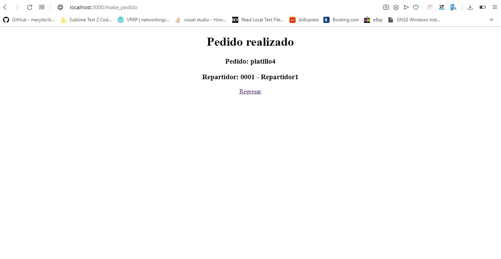

# Tarea5_SA
## Coreografia de servicios

[](https://travis-ci.org/joemccann/dillinger) [](https://app.netlify.com/sites/youthful-leakey-5d4133/deploys)

La Tarea2_SA esta compuesta por 3 programas(servicios), un cliente, un restaurante y un servidor de repartidores; con el objetivo de simular un servicio de crowdsourcing de comida a domicilio.

Con las siguientes acciones:

  1. Solicitud de comida por parte del cliente
  2. Recepción de órdenes en el restaurante
  3. Servicio de entrega por el repartidor

# Lenguaje utilizado
- nodejs(v10.16.3 con express 4.17.1)

# Constructor de artefactos
- **Gulp**
Gulp es el artefacto que se utilizó para empaquetar los servicios.
Para utilizarlo se necesita crear un archivo con el nombre ***gulpfile.js***, e instalar gulp y gulp-zip.

Run artefacto:
```
gulp Nombre_tarea
example:
gulp zip_cliente
```

#Despliegue de artefactos con
- **Netlify**
Netlify lo utilizamos para automatizar el despliegue de sitios, en este caso para desplegar los artefactos creados con gulp.

## Configurando netlify
- Primero vinculamos netlify al repositorio de github

- Despues entramos al area de configuracion

- Configuramos netlify


# Servicios
---
## ESB
Se cuenta con un ESB que sirve como orquestador de servicios, dicho orquestador corre en el puerto 9000, el cual sirve para administrar la logica de comunicacion con todos los servicios.

## Funciones del Cliente
El servidor del cliente corre sobre el puerto 3000.
### Listar platillos
Muestra la lista de platillos que consume del servicio del restaurante, para visualizarlos basta con colocar en el navegador la siguiente ruta:
``
http://localhost:3000
``
### Hacer pedido
Realiza una peticion post con la informacion necesaria para realizar una peticion al servicio del Restaurante.


## Funciones del Restaurante
Este servicio actua como un cliente y un servidor, corre sobre el puerto 5000.
### Listar platillos
Muestra la lista de platillos, para visualizarlos basta con colocar en el navegador la siguiente ruta:
``
http://localhost:5000
``
### Api listar platillos
Devuelve un json con la lista de platillos que tiene el restaurante
``
http://localhost:5000/platillos_json
``
### Api hacer pedido
Aqui es donde se realiza la accion de hacer el pedido de los platillos, recibe el platillo que sera pedido y realiza una peticion al servidor de repartidores para obtener un repartidor y devolver la informacion del pedido realizado.
Para consumir la api que realiza el pedido de debe de usar la siguiente ruta
``
http://localhost:5000/pedido
``


## Funciones del servicio de Repartidores
Este servicio actua como un servidor, corre sobre el puerto 4000.
### Listar repartidores disponibles
Muestra la lista de repartidores disponibles, para visualizarlos basta con colocar en el navegador la siguiente ruta:
``
http://localhost:4000
``
### Api listar platillos
Devuelve un json con la lista de repartidores disponibles que tiene el servidor.
``
http://localhost:4000/repartidor_json
``


# Como usar la aplicacion
---
### Run

- Abrir una terminal para cada servicio.   
- Ubicarse dentro de cada uno de los servicios y ejecutar las  siguientes lineas de codigo
```sh
$ cd Tarea2_SA
$ cd Cliente
$ npm start
```
- Abrir el navegador del cliente en la siguiente ruta 
``
http://localhost:3000
``
- Seleccionar alguno de los platillos del combobox

- Precionar el boton de *Hacer pedido*
- Nos redireccionara a otra pagina con la informacion devuelta por el servicio del restaurante.
